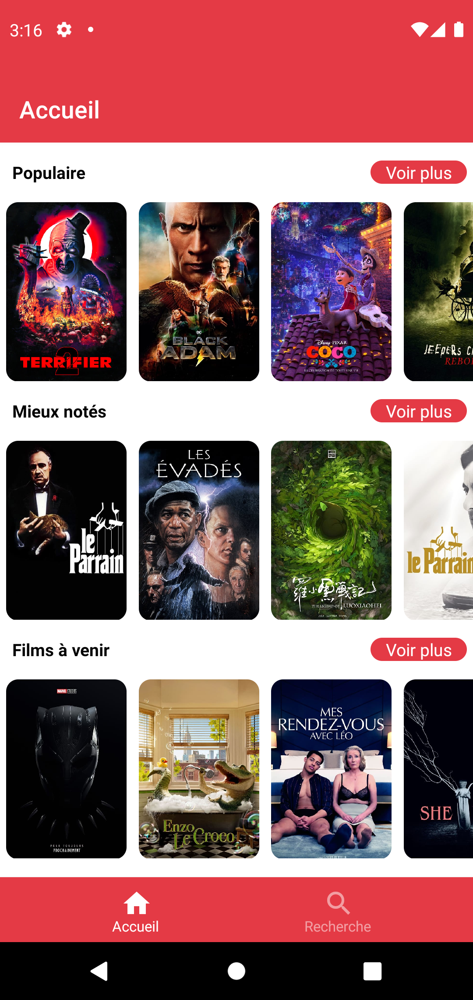
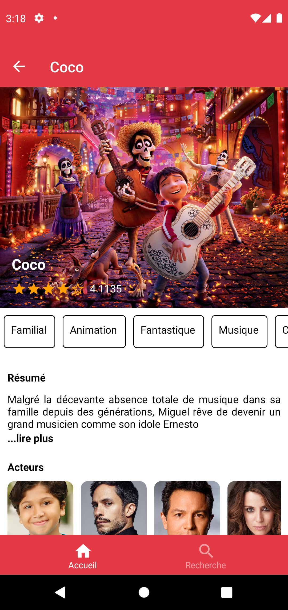
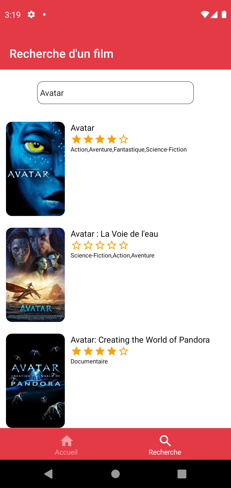
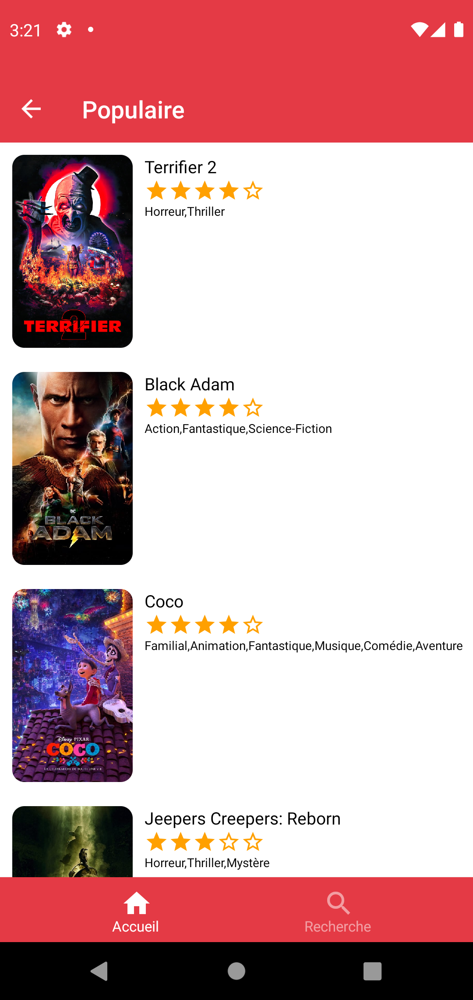

# My Movie App (je n'ai pas encore trouvé de nom :sweat_smile: )

Mini-Projet d'une application en React-Native utilisant l'API de TheMovieDB et Expo.

## Fonctionnalités

- Visualiser la liste des films populaires/à venir/mieux notés
- Visualiser les détails d'un film (résumé, images, notes, acteurs principaux)
- Recherche d'un film en particulier

## Comment lancer l'application

Tout d'abord vous aurez besoin de créer un compte sur le site de <a href="https://www.themoviedb.org/">TheMovieDB</a> afin de récupérer la variable d'environnement suivante :

```bash

REACT_APP_TMDB_API_KEY = # la clé d'API disponible après la création du compte sur le site
REACT_APP_BASE_API = # https://api.themoviedb.org/3

```

Ensuite il faut entrer ces lignes :

```bash
    npm i
```
Cette ligne servira à créer le dossier node_modules contenant les modules nécessaires pour le lancement de l'application

```bash
    $ npm run start
```

## Le front de l'application

### L'accueil



### Detail d'un film




### Recherche d'un film



### Liste des films populaires/mieux notés/à venir

